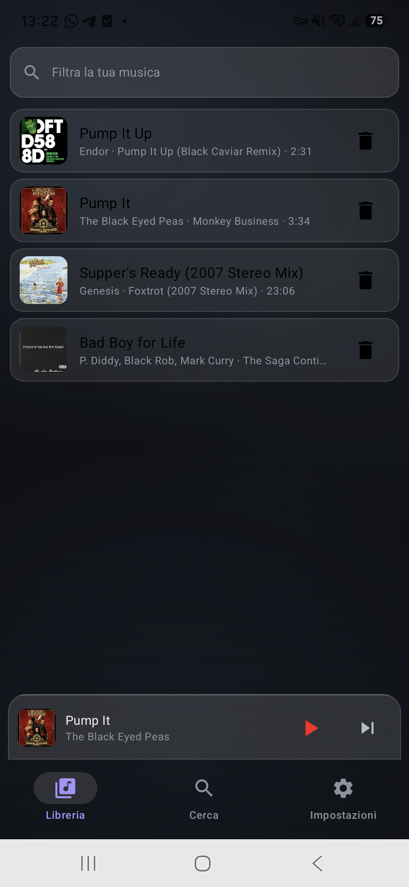
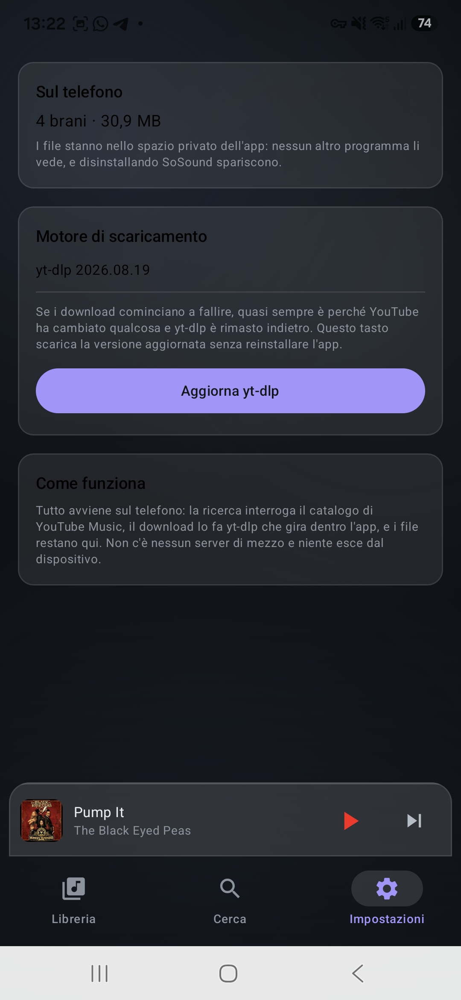

# SoSound

Un lettore musicale per Android che sta tutto dentro il telefono: cerchi
un brano, lo scarichi, lo ascolti offline con lo schermo spento. Nessun
server, niente da configurare.

  
  

## Caratteristiche

- Ricerca **Brani, Album, Artisti, Podcast** tramite l'API di YouTube Music
- Scaricamento e ascolto offline, senza ricodifica: nessuna perdita di
  qualità, nessuna attesa
- Libreria con playlist, e import delle playlist da **Spotify**
- **Trasmissione** su Chromecast e su dispositivi DLNA/UPnP (TV, casse)
- Controlli sulla schermata di blocco e sugli auricolari Bluetooth
- Il motore di scaricamento (`yt-dlp`) si aggiorna da sé, senza reinstallare l'app

## Installazione

L'APK non passa dal Play Store: si installa a mano.

1. Prendi **`SoSound-arm64.apk`** dalle [Release](../../releases) (va
   bene per la maggior parte dei telefoni degli ultimi dieci anni). Se dà
   errore di architettura, usa `SoSound-universal.apk`
2. Aprilo dal gestore file e concedi «installa app sconosciute»
3. Aprila. Non c'è niente da configurare

## Legale

SoSound non è affiliato con YouTube, Google o Spotify, non ospita alcun
contenuto e non ha un server: ogni scaricamento è una connessione diretta
fra il telefono e YouTube. È distribuito sotto **GPL-3.0**, senza alcuna
garanzia, ed è responsabilità di chi lo usa rispettare le leggi sul
copyright della propria giurisdizione. Dettagli in
[`DISCLAIMER.md`](DISCLAIMER.md), licenza in [`LICENSE`](LICENSE),
dipendenze in [`THIRD-PARTY-NOTICES.md`](THIRD-PARTY-NOTICES.md).
